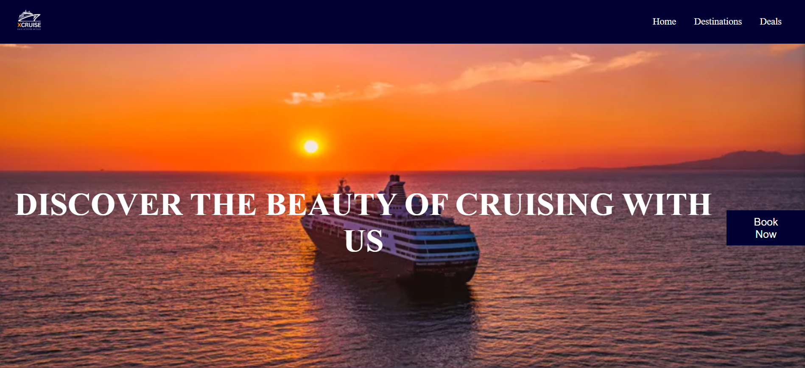

# XCruise | Landing Page with Mobile Responsive

- XCruise is a responsive static website built from scratch using HTML and CSS to provide a seamless and visually appealing experience for users looking to book cruise vacations. The project involved developing a responsive and interactive website that showcases various cruise destinations and provides essential information about XCruise offerings.

## This project includes the following features
* XCruise UI (Navbar and Hero Section)

* XCruise UI (Discover Grid)

* XCruise UI (Contact and Footer Sections)
  

## Build the XCruise Landing Page

* Designed and implemented a responsive navigation bar that integrates a custom logo and interactive links to various sections of the site.
* Designed the hero section with a background image and a call-to-action button.
* Created a 'Discover' section to showcase popular and exotic cruise destinations using dynamically styled cards and interactive image pills. 
* Leveraged CSS Grids to facilitate a more structured and aesthetically consistent arrangement of content, contributing significantly to the overall user experience.
* Implemented responsive design for the contact section to ensure readability and ease of access on mobile devices.
* Designed a comprehensive footer section with categorized links for easy navigation and social media icons to increase user engagement.

### Skills used
HTML5, Semantic HTML, CSS, CSS Positioning, Media Queries, CSS Flexbox, CSS Grids, Responsive Design

